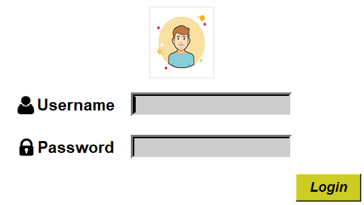
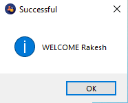
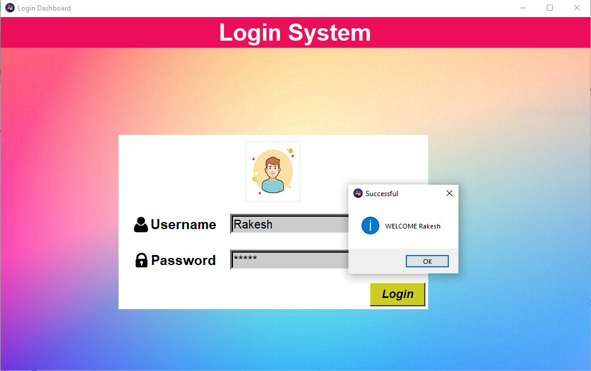

<h2> Welcome to the <em>Login Dashboard</em></h2> 

<b><u>Hye!</u></b> I am <em><u>Rakesh Yadav</u></em>, I welcome you all and will be <i>highlighting</i> the main  purpose of creating this page one by one.
    
   I created this <b>login-dashboard</b> to demonstrate the real-life <em>implementation of coding knowledge</em>. When I was creating this, very few things were in my mind but after completion I learned lots of things than starting expectations.
    
    
   If you are beginner than you  might be excited to know what I'm all talking about. So without boring you, lets jump into <i>the real-arena  of coding skill presentation</i>.

 
 <table border="0" cellpadding="15" cellspacing="1">
 <H6>Pre-Requisites</H6>
  <tr>
    <td><Button>Python 3.7</Button></td>
    <td><Button>Python IDE (Pycharm, VS-code, etc.)</Button></td>
  </tr>
 
   <ul ><em> <b>pip  install PIL </b></em></ul>
</table>

<h3><em><strong>Screenshots </strong></em></h3> 
<table border="1" align="right" cellpadding="20" cellspacing="8">
<tr>
<td></td>
</tr>
<tr>
<td></td>
</tr>
<td></td>
</table>